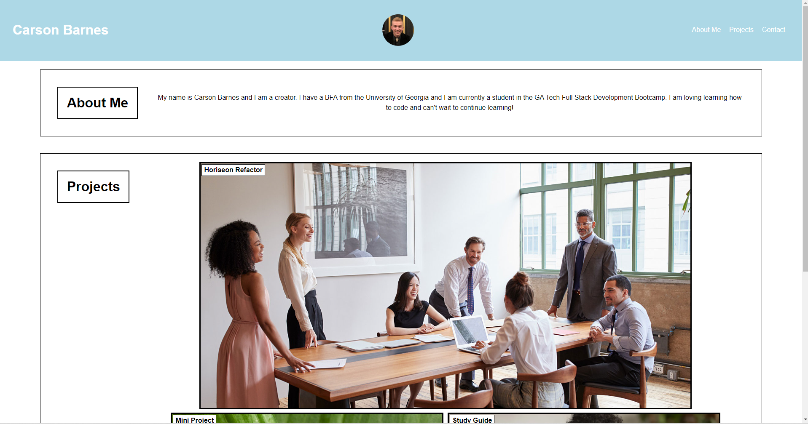
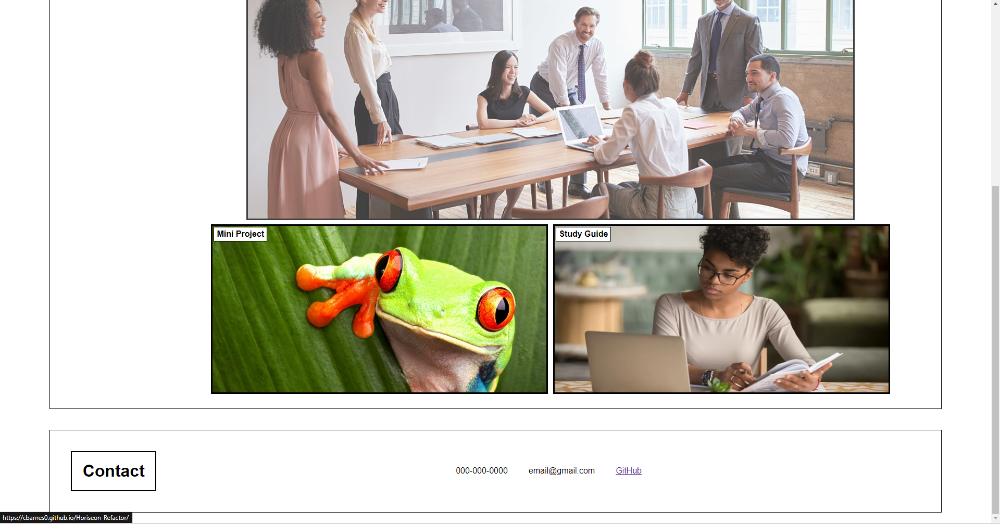
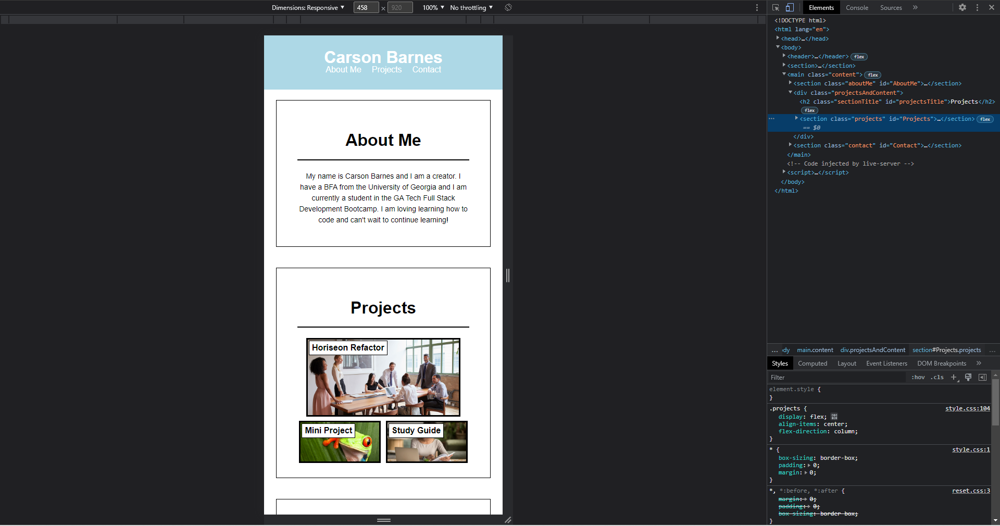

# <Advanced-CSS-Portfolio>

## Description

The aim of the project was to create my own portfolio meeting acceptance criteria. The website needed functional nav links, functional image links to outside projects, titles for each section with content (about me, projects, contact info), as well as a responsible layout. Through working on this project I learned quite a lot more about mobile first development and responsive web design in general. I now feel much more confident in my ability regarding the CSS and HTML that we have learned.

## Screenshots

## Link

https://cbarnes0.github.io/Advanced-CSS-Portfolio/